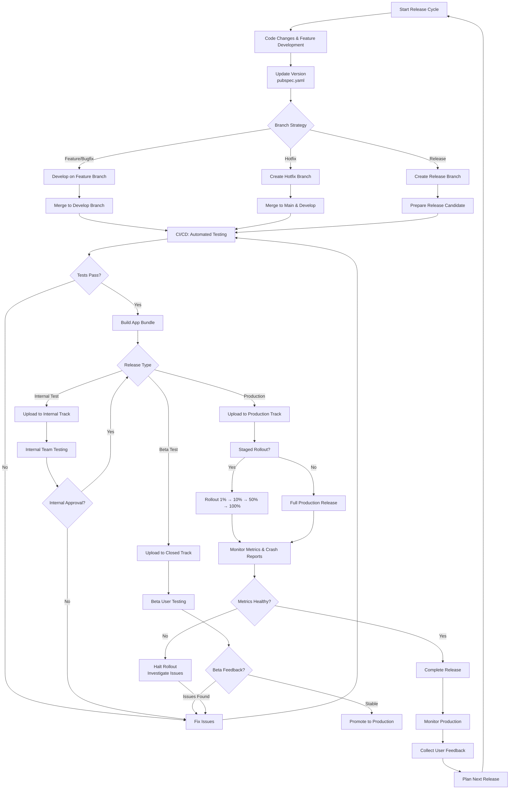
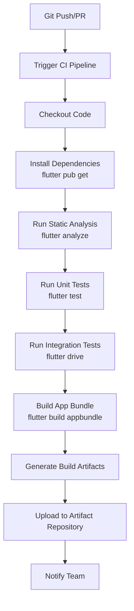

## Recurring Release Pipeline

```mermaid
flowchart TD
    A[Start Release Cycle] --> B[Code Changes & Feature Development]
    B --> C[Update Version<br>pubspec.yaml]
    C --> D{Branch Strategy}
    D -->|Feature/Bugfix| E[Develop on Feature Branch]
    D -->|Hotfix| F[Create Hotfix Branch]
    D -->|Release| G[Create Release Branch]

    E --> H[Merge to Develop Branch]
    F --> I[Merge to Main & Develop]
    G --> J[Prepare Release Candidate]

    H --> K[CI/CD: Automated Testing]
    I --> K
    J --> K

    K --> L{Tests Pass?}
    L -->|No| M[Fix Issues]
    M --> K
    L -->|Yes| N[Build App Bundle]

    N --> O{Release Type}
    O -->|Internal Test| P[Upload to Internal Track]
    O -->|Beta Test| Q[Upload to Closed Track]
    O -->|Production| R[Upload to Production Track]

    P --> S[Internal Team Testing]
    Q --> T[Beta User Testing]

    S --> U{Internal Approval?}
    T --> V{Beta Feedback?}

    U -->|No| M
    U -->|Yes| O
    V -->|Issues Found| M
    V -->|Stable| W[Promote to Production]

    R --> X[Staged Rollout?]
    X -->|Yes| Y[Rollout 1% → 10% → 50% → 100%]
    X -->|No| Z[Full Production Release]

    Y --> AA[Monitor Metrics & Crash Reports]
    Z --> AA

    AA --> AB{Metrics Healthy?}
    AB -->|No| AC[Halt Rollout<br>Investigate Issues]
    AC --> M
    AB -->|Yes| AD[Complete Release]

    AD --> AE[Monitor Production]
    AE --> AF[Collect User Feedback]
    AF --> AG[Plan Next Release]
    AG --> A
```

## CI/CD Pipeline

```mermaid
flowchart TD
    A[Git Push/PR] --> B[Trigger CI Pipeline]
    B --> C[Checkout Code]
    C --> D[Install Dependencies<br>flutter pub get]
    D --> E[Run Static Analysis<br>flutter analyze]
    E --> F[Run Unit Tests<br>flutter test]
    F --> G[Run Integration Tests<br>flutter drive]
    G --> H[Build App Bundle<br>flutter build appbundle]
    H --> I[Generate Build Artifacts]
    I --> J[Upload to Artifact Repository]
    J --> K[Notify Team]
```
